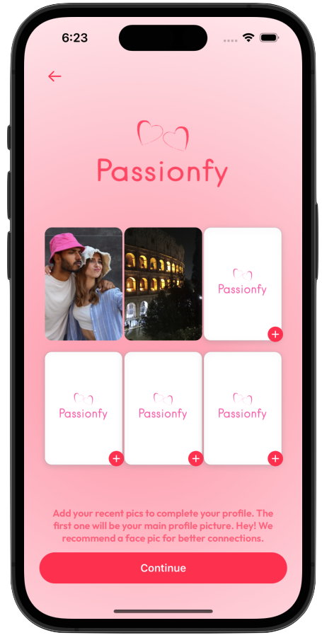
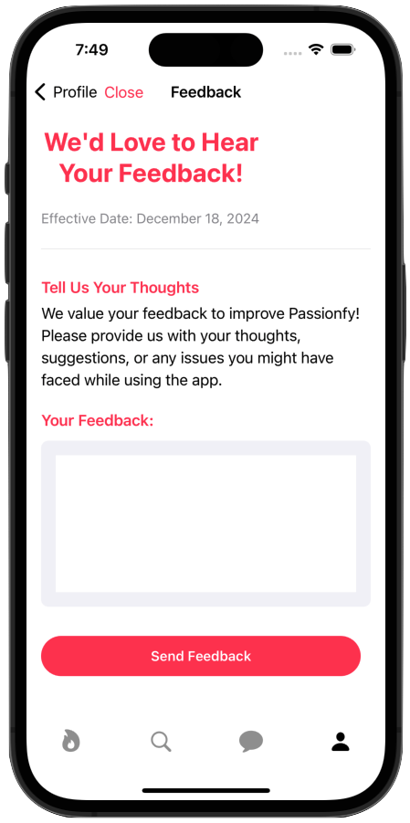

# Passionfy 💕✨ - Where Love Begins 🌟❤️


Welcome to **Passionfy**, a sleek and dynamic app designed to help you discover connections, explore shared interests, and spark meaningful relationships! 🌟 Built exclusively for **iOS 16** using the powerful **SwiftUI**, Passionfy offers a feature-rich experience with eye-catching design and smooth animations. 🎉

This app is powered by **SwiftUI**, Apple's declarative framework for building modern user interfaces, and follows **Clean Code** principles to ensure scalability, maintainability, and high performance. 

I would like to express my sincere gratitude to the [AppStuff](https://www.youtube.com/@appstuff5778) YouTube channel for providing such valuable resources. I used one of the channel’s videos as a key learning tool and starting point for developing my SwiftUI app. The tutorial was incredibly helpful in understanding UI development, and it gave me a solid foundation to build upon. Since then, I’ve made significant modifications to the app with my own architecture approach and added new features. Your content has been a huge inspiration and has played a key role in my progress. Thanks again for all the help!

<p align="center">
  
  
  
  
  
</p>


## ✨ Features That Make Passionfy Unique:
- **Create Your Profile**:  
  🎂 Share your age  
  🌍 Specify your location  
  🎨 Highlight your hobbies and interests  
  🏳️‍🌈 Indicate your sexual orientation  
  📸 Upload multiple photos to showcase your best self!  

- **Explore & Match**:  
  🔍 Browse through profiles tailored to your preferences  
  ❤️ Connect with people who share your vibe  

- **Chat with Matches**:  
  💬 Enjoy real-time, private conversations with your matches  

- **Emojis & Personalization**:  
  ✨ A touch of fun with emojis across the app to keep interactions light and lively  

## 👩‍💻 Technical Highlights:
- **SwiftUI Framework**:  
  Utilizes cutting-edge **SwiftUI** technology for a modern and responsive user experience.  

- **Clean Architecture**:  
  Designed with clean architecture principles to ensure a scalable and maintainable codebase.  

- **Best Practices**:  
  Follows industry standards for coding, making the app reliable and efficient.  

- **Stunning Design**:  
  Vibrant, elegant, and user-friendly design to keep users engaged while they find their perfect match.  

With Passionfy, we’re not just creating a dating app—we’re building a **community** where people can connect and grow together, all while enjoying a fun and seamless experience. 🌈✨

## App Screenshots

Here are some screenshots from our app to give you a glimpse of its design and functionality.








## Contributing 🤝

Contributions are welcome! If you'd like to contribute to Passionfy, please fork the repository and create a pull request with your changes.

## Acknowledgements 🙏

Passionfy is inspired by the functionality and design of Tinder.

We express our deep appreciation to [Freepik](https://www.freepik.es/) for generously providing the resources used in this project.

I would like to express my sincere gratitude to the [AppStuff](https://www.youtube.com/@appstuff5778) YouTube channel for providing such valuable resources. I used one of the channel’s videos as a key learning tool and starting point for developing my SwiftUI app. The tutorial was incredibly helpful in understanding UI development, and it gave me a solid foundation to build upon. Since then, I’ve made significant modifications to the app with my own architecture approach and added new features. Your content has been a huge inspiration and has played a key role in my progress. Thanks again for all the help!

Template mockup from https://previewed.app/template/AFC0B4CB

## Visitors Count


## Please Share & Star the repository to keep me motivated.
<a href = "https://github.com/sergio11/passionfy/stargazers">
   
</a>

## License ⚖️

This project is licensed under the MIT License, an open-source software license that allows developers to freely use, copy, modify, and distribute the software. 🛠️ This includes use in both personal and commercial projects, with the only requirement being that the original copyright notice is retained. 📄

Please note the following limitations:

- The software is provided "as is", without any warranties, express or implied. 🚫🛡️
- If you distribute the software, whether in original or modified form, you must include the original copyright notice and license. 📑
- The license allows for commercial use, but you cannot claim ownership over the software itself. 🏷️

The goal of this license is to maximize freedom for developers while maintaining recognition for the original creators.

```
MIT License

Copyright (c) 2024 Dream software - Sergio Sánchez 

Permission is hereby granted, free of charge, to any person obtaining a copy
of this software and associated documentation files (the "Software"), to deal
in the Software without restriction, including without limitation the rights
to use, copy, modify, merge, publish, distribute, sublicense, and/or sell
copies of the Software, and to permit persons to whom the Software is
furnished to do so, subject to the following conditions:

The above copyright notice and this permission notice shall be included in all
copies or substantial portions of the Software.

THE SOFTWARE IS PROVIDED "AS IS", WITHOUT WARRANTY OF ANY KIND, EXPRESS OR
IMPLIED, INCLUDING BUT NOT LIMITED TO THE WARRANTIES OF MERCHANTABILITY,
FITNESS FOR A PARTICULAR PURPOSE AND NONINFRINGEMENT. IN NO EVENT SHALL THE
AUTHORS OR COPYRIGHT HOLDERS BE LIABLE FOR ANY CLAIM, DAMAGES OR OTHER
LIABILITY, WHETHER IN AN ACTION OF CONTRACT, TORT OR OTHERWISE, ARISING FROM,
OUT OF OR IN CONNECTION WITH THE SOFTWARE OR THE USE OR OTHER DEALINGS IN THE
SOFTWARE.
```

